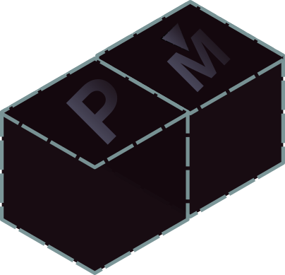

<div align="center" style="display:grid;place-items:center;">
<p>
    <a target="_blank"></a>
</p>


[](https://github.com/LostbBlizzard/postmake/actions/workflows/go.yml)
<a href="https://github.com/LostbBlizzard/postmake/actions/workflows/go.yml">

<h1>Postmake</h1>

postmake is a tool made generate installer scripts Such as Unix Shell Scripts,Inno Setup Scripts and GitHub Actions from a lua script.
Lastly a plugin system for any other installer formats not built in.

The postmake script is an lua script allowing you to make many installers using one script or use logic to your customized your installers.

# Useage
your postmake.lua
```lua
local innosetup = postmake.loadplugin("internal/innosetup")

local InnoAppID = "###{INNOAPPID}###"

postmake.appname = "app"
postmake.appversion = "0.0.1"
postmake.output = "./output/install"

postmake.appinstalldir = "~/.app"

-- Short Hands
local all = postmake.allconfig
--local unix = postmake.foros("unix")
--local winodows = postmake.foros("winodws")
--local linux = postmake.foros("linux")
--local macos = postmake.foros("macos")

--- Configs
local win = postmake.newconfig("windows", "x64")
local gnu = postmake.newconfig("linux", "x64")
local mac = postmake.newconfig("macos", "x64")

local winsmainprogram = postmake.installdir() .. "./" .. postmake.appname .. ".exe"

win.addfile("main.exe", winsmainprogram)
gnu.addfile("main", postmake.installdir() .. "./" .. postmake.appname)
mac.addfile("main_macos", postmake.installdir() .. "./" .. postmake.appname)

all.addfile("License.md", postmake.installdir() .. "./License.md")

postmake.make(shellscript, { gnu, mac }, {});
postmake.make(innosetup, { win }, { AppId = InnoAppID, LaunchProgram = winsmainprogram, LicenseFile = "License.md" });
```
then run postmake build.

# Install

## Windows
Go to [releases](https://github.com/LostbBlizzard/postmake/releases/latest) and download the and run the postmakeSetup.exe.

## Unix(Mac or Linux)

```
bash -c "$(curl -L https://github.com/LostbBlizzard/postmake/releases/latest/download/install.sh)"
```
or go to [releases](https://github.com/LostbBlizzard/postmake/releases/latest) and download the install.sh and run it in your shell.

## GitHub Actions
[Repository](https://github.com/LostbBlizzard/postmake-action/tree/master) 
[GitHub Marketplace]() 

# Docs
[Documentation](https://lostbblizzard.github.io/postmake/cli/index.html)
[Command Line Tool](https://lostbblizzard.github.io/postmake/)
[Lua API](https://lostbblizzard.github.io/postmake/lua/postmake.html)

# Other Notes
- All Installation methods were all made using the program.
- Your may use the postmake.lua at the project root for inspiration.
- This Project is inspired by [premake](https://premake.github.io/docs/What-Is-Premake). 


